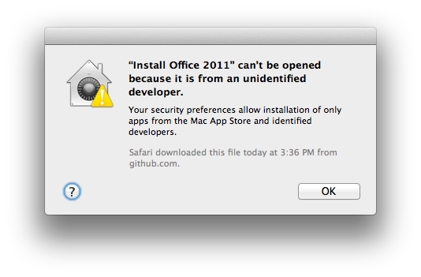
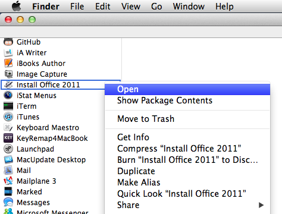
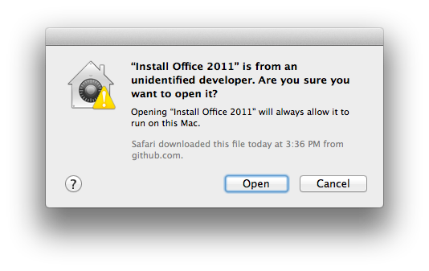
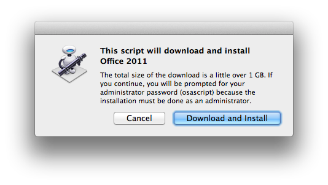
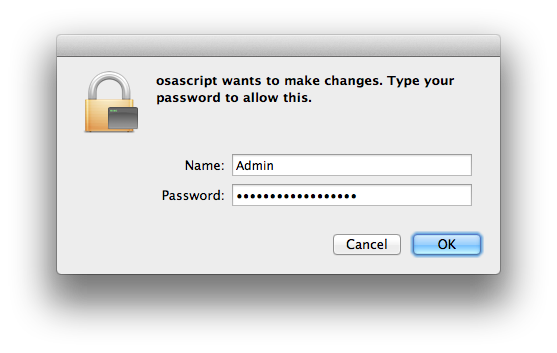

office2011
==========

A shell script to (download, if necessary) and install Office:Mac 2011 and any known updates without any user intervention.

## Intended Usage

Simply put, this script is intended to quickly let you download and install the latest version of Microsoft Office 2011.

This is most often useful for when you are setting up a new Mac.

Setting up _more_ than one Mac? Run this script on one Mac, and then copy the `~/Downloads/Office2011/` folder from one computer to another after the installation is finished. That way you will not need to re-download the files, which should save time and bandwidth.

Note that *all* downloads come from Microsoft’s official servers. You are not downloading them off GitHub, or my website, or any other random site. These are official distributions. (See [HeiDoc.net][1] for more information.)

(_Nerdy Technical Security Details_: The script verifies the checksum of each download using `shasum -a 256` to verify that it has not been tampered with or changed. If it does not match, installation will immediately stop.)

## There are a few provisos, a couple of *quid pro quos*… ##

1. This script is not officially endorsed suggested, recommended, or any such words to that effect by Microsoft or any Microsoft affiliated business, entity, person, or persons. (In fact I'm fairly sure Microsoft does not even know that I am alive.)

2.  All trademarks are used solely for identification.

3. This script has been tested with me (and others) but comes with absolutely no guarantees. If it works, hurrah! If it breaks, you get to keep both pieces. **Anything that happens as a result of you running this will be your responsibility.** Not mine, certainly not Microsoft's, etc.

4. This script will ***not*** provide you with a free copy of Microsoft Office 2011. All it will do is download the necessary pieces and install them. You will still have to enter your Product Key within 30 days of installation.

## What it does ##

The `office2011.sh`  script will look for certain DMG files in a particular folder in your hard drive (by default it will use `~/Downloads/Office2011/` but it will use another folder if you change the `DIR="$HOME/Downloads/Office2011"` line near the top of the script.

Here is the current (as of 2015-02-14) list of what it will install:

1.  [Microsoft Office 2011 (SP2)][1] 					([Direct Download][2])

2. 	[Microsoft Office for Mac 2011 14.5.0 Update][3] 	([Direct Download][4])

3.	[Microsoft Error Reporting for Mac 2.2.9 Update][5]	([Direct Download][6])

4.	[Microsoft AutoUpdate for Mac 2.3.6 Update][7] 		([Direct Download][8])

The script is intended to be smart enough to check whether minimum requirements are met, and also to check to make sure that it does not install something which has already been installed.

## How to break, fool, or confuse this script ##

1. If you have a version of Microsoft Office installed which is less than 14.2.0 you will need to download and install [Microsoft Office for Mac 2011 Service Pack 2][9].

2. There are probably other ways too.

## Q: “Does using this script give me _any_ different result than if I had installed Office manually using OS X’s Installer.app?” ##

A. Yes.

The only known side effect of using this script is that the Microsoft Office apps are not
automatically added your Dock, as they are if you use the GUI installer.

This is considered a feature.

### GUI Installer ###

**Update 2013-12-29:** [office2011.sh][11] has been significantly updated, and I have verified that [the Installer](https://github.com/tjluoma/office2011/raw/master/Installer.zip) works on a clean installation which has never had Office installed before.

The installer application is an Automator application and not officially signed, you will see this warning if/when you try to launch it:

You _could_ disable Gatekeeper in OS X’s settings, but I consider that to be a very bad idea, because _exceptions_ can be made very easily using a _one time per app_ process, which I will explain here:.

Simply selecting the application that you want to open and then control-click (or right-click) to bring up this contextual menu:

Choose “Open” and it will ask you to confirm your choice:

Once you choose "Open" from the above the menu, the application will run, and you will not have to authorize it again on that computer.

The **“Install Office 2011”** application will then download the latest version of [office2011.sh][11] to `~/Downloads/office2011.sh` and run it to download and install Office 2011 files, if necessary. The downloads will be saved to **~/Downloads/Office2011/** and that folder can be moved to other Macs (as long as it is put at **~/Downloads/Office2011/**) and the installer can be re-run without having to download the DMGs.

Because you will need to enter your administrator password, it will prompt you (last time!) before it begins:

Finally you will see the usual authentication window asking for your name and password:

Once the script is downloaded and begins to run, a log file will be created in **~/Library/Logs/** (the standard OS X location for log files).

That log file will be opened in the standard **/Applications/Utilities/Console.app** application so you can watch the installation’s progress. (However, I recommend going away to do something fun instead, and just check back later.)

<!-- Reference Links -->

[1]:	http://www.heidoc.net/joomla/technology-science/microsoft/61-office-2011-for-mac-direct-download-links

[2]:	https://drcdn.blob.core.windows.net/mac/X18-08827.dmg

[3]:	http://support.microsoft.com/kb/3062536 "Microsoft Office for Mac 2011 14.5.0 update"

[4]:	http://download.microsoft.com/download/9/8/4/9847DA34-7D54-4ECF-86A7-EDA4E0F9D29E/Office2011-1450Update_EN-US.dmg

[5]:	http://www.microsoft.com/en-us/download/details.aspx?id=35382 "Microsoft Error Reporting for Mac 2.2.9 Update"

[6]:	http://download.microsoft.com/download/B/F/B/BFB8DEB8-91CD-4722-AE6F-476C4013CFFC/MERP_229.dmg

[7]:	http://www.microsoft.com/en-us/download/details.aspx?id=35381 "Microsoft AutoUpdate for Mac 2.3.6 Update"

[8]:	http://download.microsoft.com/download/B/0/D/B0DB40D2-FF90-4633-925A-B8A7D4183279/AutoUpdate_236.dmg

[9]:	http://support.microsoft.com/kb/2685940 "Description of the Office for Mac 2011 14.2 update"

[11]:	https://github.com/tjluoma/office2011/blob/master/office2011.sh
